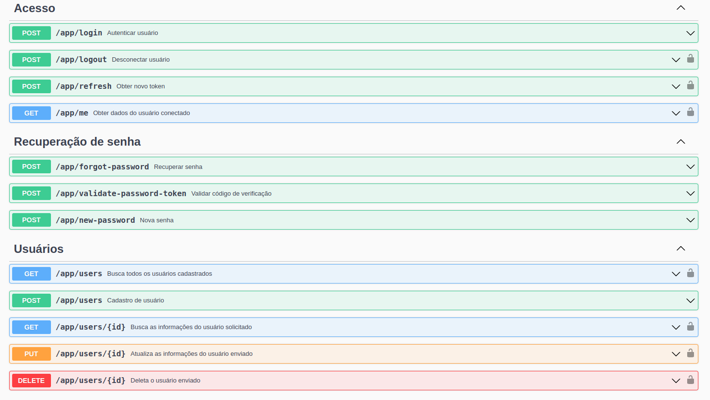

# API controle de acesso

<p align="center">
  
</p>

:small_blue_diamond: [Descrição do projeto](#descrição-do-projeto)

:small_blue_diamond: [Funcionalidades](#funcionalidades)

:small_blue_diamond: [Pré-requisitos](#pré-requisitos)

:small_blue_diamond: [Como executar a aplicação](#como-executar-a-aplicação)

# Descrição do projeto

Projeto construído para comprovar conhecimentos nas tecnologias:

- Framework PHP (Laravel)
- Banco de dados (Mysql)
- Infra (Docker)
- Testes automatizados (PHPUnit)
- Documentação (Swagger)

# Funcionalidades

- CRUD de usuário;
- Login, refresh token e logout;
- Recuperação de senha via email;

# Pré-requisitos:

Ter instalado em seu computador docker e docker compose.

# Como executar a aplicação
Faça o clone do projeto:
```bash
$ git clone https://github.com/filipeassuncao/laravel-access-control.git
```

Execute os dois comandos abaixo (em ambiente linux) para resgatar os valores de usuario e uid utilizados na configuração do cotainer do docker.

Subistitua o valor da variável USER no arquivo .env pelo resultado do comando abaixo:
```bash
whoami
```
Subistitua o valor da variável UID no arquivo .env pelo resultado do comando abaixo:
```bash
id -u
```
Escolha um servidor de email de sua preferência e preencha as variaveis de ambiente no arquivo .env com suas credencais.

```bash
MAIL_MAILER
MAIL_HOST
MAIL_PORT
MAIL_USERNAME
MAIL_PASSWORD
MAIL_ENCRYPTION
MAIL_FROM_ADDRESS
```
 Na primeira vez que for iniciar o container, na pasta raiz do projeto, rode o comando que irá realizar a configuração do ambiente da aplicação:

```bash
sh build.sh
```

---

# Acesso

1 - Acesse no seu browser http://localhost:6001

#  Documentação via swagger

2 - Acesse no seu browser http://localhost:6001/api/documentation

# Licença 

Licença (MIT)

Copyright :copyright: 2022 - API controle de acesso